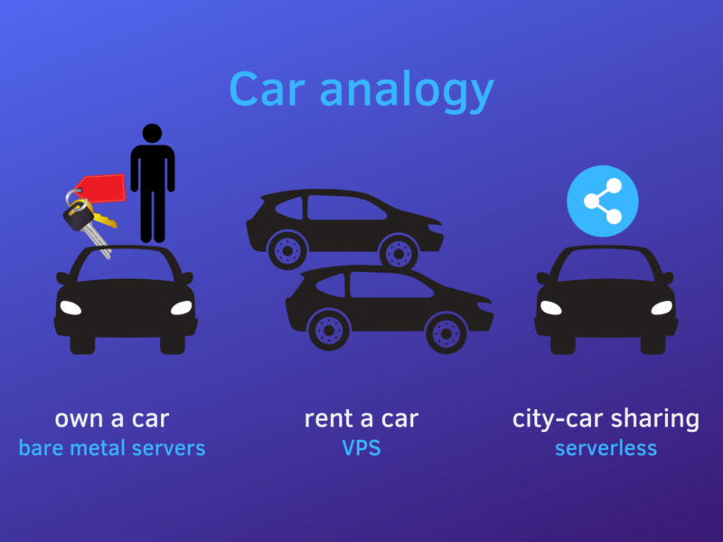
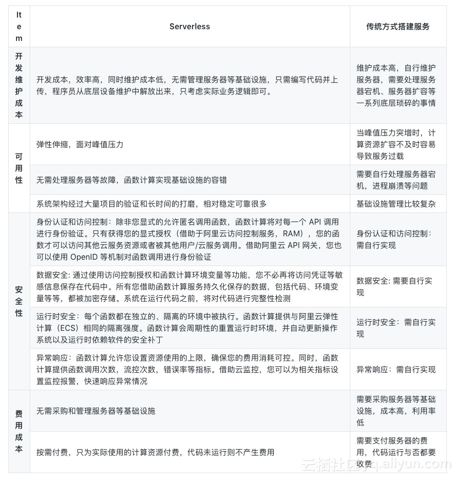
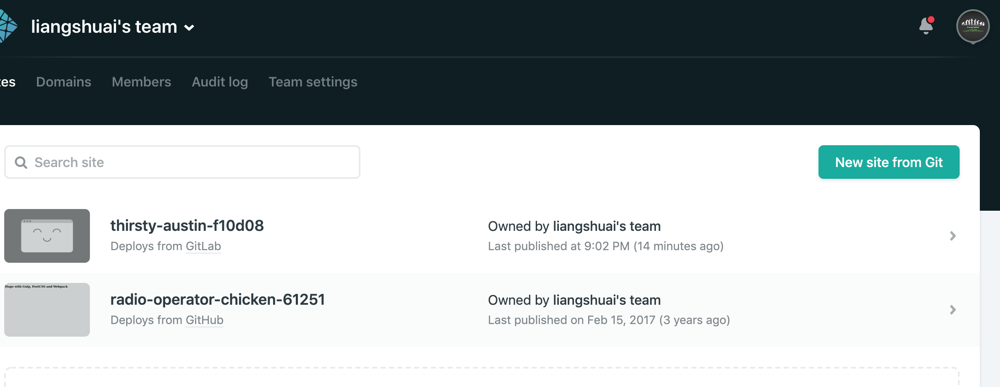
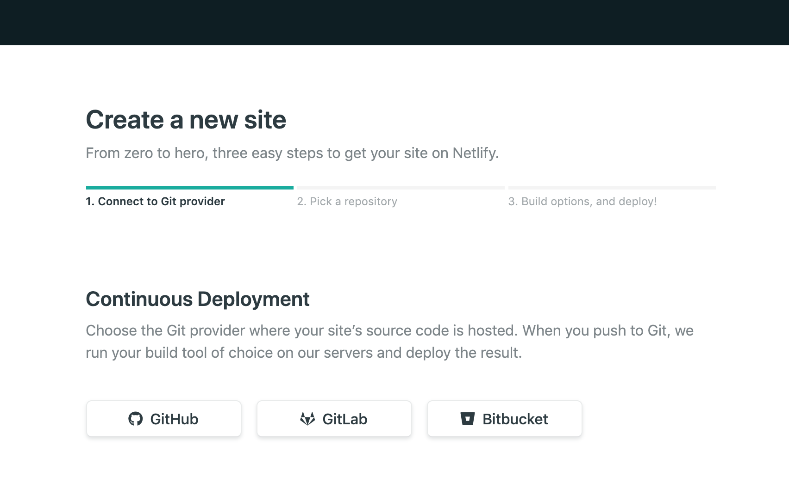
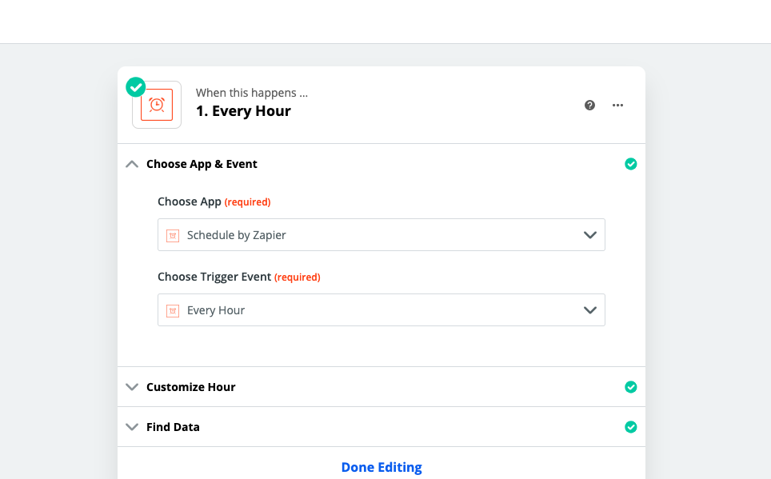
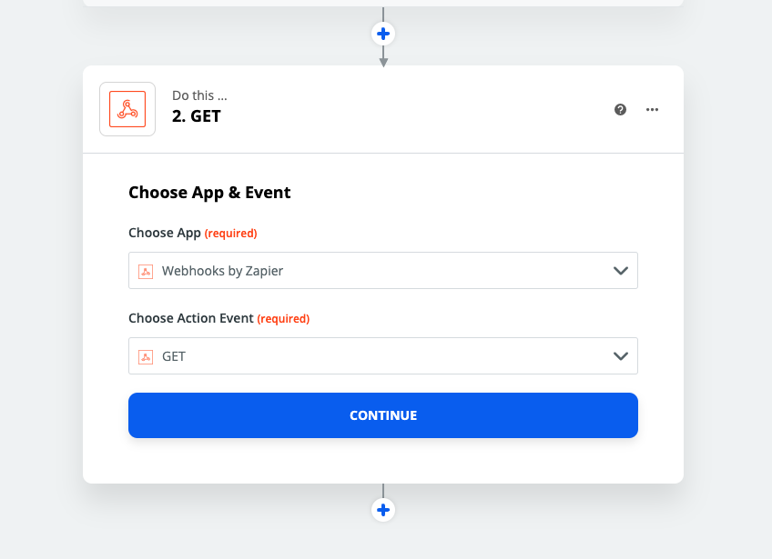
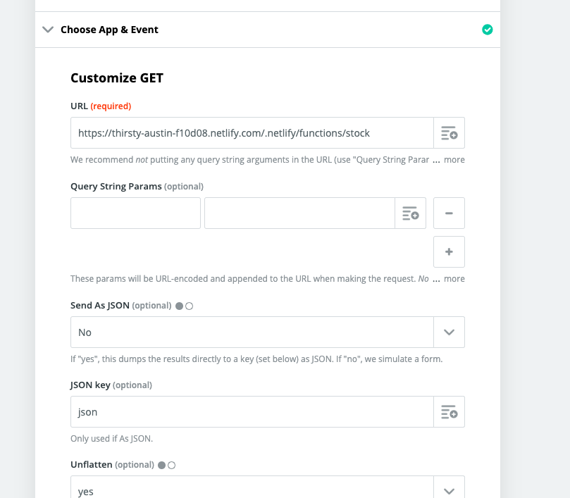

# Serverless分享 课件

## 简介

> 无服务器运算（英语：Serverless computing），又被称为功能即服务（Function-as-a-Service，缩写为 FaaS），是云计算的一种模型。以平台即服务（PaaS）为基础，无服务器运算提供一个微型的架构，终端客户不需要部署、配置或管理服务器服务，代码运行所需要的服务器服务皆由云端平台来提供。亚马逊公司在2014年推出AWS Lambda，是最早提供这个服务的供应商

形象的比喻


1. 最古老的方式，买服务器， 找机房托管服务器， 以及进行运维
2. 租用VPS、云服务器、虚拟机等方式， 省去了对服务器的物理管理，上线祝需要专注于软件环境搭建就可以了
3. Serverless连软件环境都已经准备好了， 一键部署，并且可以自动伸缩， 具有高可用性



### Serverless特点

1. 只需要关心核心业务逻辑， 提升开发和运维的效率
2. 基于事件触发， 灵活扩展
3. 可以弹性收缩和扩容
4. 按需付费，执行了才收费
5. 细粒度的计算资源分配
6. 无状态

### 应用场景

1. WebHook
2. 聊天机器人
3. 发送通知
4. 定时执行任务
5. 网站和应用， 不需要长时间运行的， 冷启动时间较长的不适用
6. 类型转换, 比如生成PDF, JSON格式转换, 图片压缩处理, 图像识别等
7. 统计与监控

## 结构

AWS Lambda相对来说操作复杂一些, 这次技术分享使用Netlify提供的Lambda, 相对来说简单一些, 并且最终也是运行在AWS Lambda

一个最基本的Serverless Function结构类似如下

```js
exports.handler = (event, context, callback) => {
    // 函数的具体实现
}
```

这个无论AWS lambda还是Netlify lambda 还是国内阿里云或者平安云 都是一样的
其中 

* `event` 包含了request相关的所有data
* `context` 包含了用户的认证信息
* `callback` 用户创建response

callback的回传的参数有两个, 类似Node.js , 第一个是error, 如果没有error的话写 null 就可以了

## Hello World

```bash
mkdir netlify-demo
cd netlify-demo
npm init -y
npm i -S netlify-lambda

```

编辑package.json

```json
"scripts": {
    "start:lambda": "netlify-lambda serve src/lambda",
    "build:lambda": "netlify-lambda build src/lambda"
}
```

`src/lambda/helloworld.js` 中代码如下

```js
exports.handler = (event, context, callback) => {
  callback(null, {
        statusCode: 200,
        body: 'Hello, world!',
    });
}; 
```

`netlify.toml` 

```toml
[build]
    Functions = "lambda"
    Command = "npm run build:lambda"

```

本地运行

```bash
npm run start:lambda
```

然后在 http://localhost:9000/helloworld 访问

Github或者Gitlab提交之后在Netlify中 





之后就不用管了, 每次Git push之后就自动更新了


https://thirsty-austin-f10d08.netlify.com/.netlify/functions/helloworld


	


## Zapier定时任务监控股票价格


```js
const axios = require('axios')
const nodemailer = require('nodemailer')

const URL = 'http://hq.sinajs.cn/list=sh601318'
const getCurrentPrice = async function () {
    const res = await axios.get(URL)
    const arr =  res.data.split(',')
    return arr[3]
}

exports.handler = async function (event, context, callback) {
    const price = await getCurrentPrice()
    let transporter = nodemailer.createTransport({
        service: '163',
        secureConnection: true,
        auth: {
            user: 'serverless_demo@163.com',
            pass: 'serverless123'
        }
    })

    transporter.sendMail({
        from: 'serverless_demo@163.com',
        to: 'serverless_demo@163.com',
        subject: 'Price updated',
        html: price
    }, (error, info) => {
        if (error) {
            return callback(error)
        }
        callback(null, {
            statusCode: 200,
            body: price
        })
    })
    
}
```

Zapier设置








## 实战案例

[基于netlify-lambda  + faunadb + react hooks的博客简单示例](https://github.com/liangshuai/serverless-blog)

