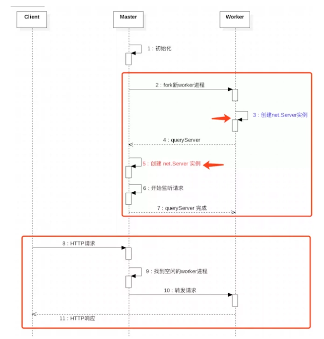
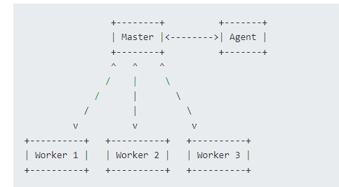

# 多进程模型

通常主从模型包含一个主进程master和多个从进程， 主进程负责接收连接请求以及把单个请求任务分发到从进程处理， 从进程的职责就是不断相应客户端请求，直至进入等待状态

为了利用多核系统， Node.js提供cluster模块作为解决方案， cluster

* 在服务器上同时启动多个进程
* 每个进程里都跑的是同一份源代码
* 这些进程可以同时监听一个端口

Cluster模块通过两种方式分发请求

1. 轮询， 以轮询方式分发给worker进程实现负载均衡
2. 主进程创建监听套接字， 将请求直接转发给相应的worker

Node.js 不提供路由逻辑， 因此需要创建一个application来管理Session和Login等信息， 以避免过分依赖内存数据

* 每个worker都是各自独立的进程， 因此它们会在彼此互不影响的情况下根据程序需要被kill或重新创建
* 只有还有alive的worker， 服务器就会继续接收连接请求， 如果没有alive的worker， 现有的连接会被丢弃， 同时不再接收新的连接请求
* node.js 不会自动的管理worker的数量， application也需要根据自己的需求来管理worker池

## 为什么从进程不会报端口占用

* 从进程向主进程注册该进程的worker， 若master进程是第一次监听此端口、描述符下的worker, 则起一个内部TCP服务器来承担监听该端口、描述符的职责， 随后在master中记录下该worker
* Hack掉worker进程中net.Server实例的listen方法里面监听端口、描述符的部分， 使其不再承担该职责

Egg的进程模型

Master作为主进程， 启动agent作为秘书进程协助worker处理一些公共事务， 比如日志。 启动Worker进程执行真正的业务代码

进程间通信用事件机制和IPC通道来达到各个进程之间的通信