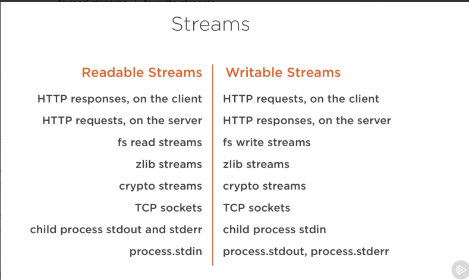
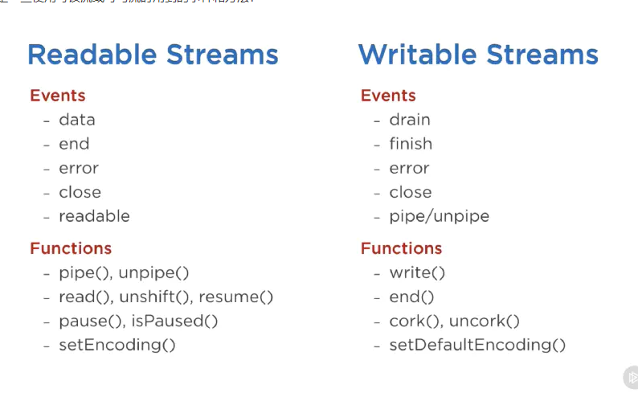

# Stream

流是数据的集合，就像数组或字符串一样， 区别在于流中的数据可能不会立刻全部 可用， 并且不需要一次性把这些数据全部放入内存， 这样操作大量数据或从外部来源逐段发送过来的时候变得非常有用




## 流的类型

Node.js中有四种基本类型的流

* 可读流
* 可写流
* 双向流
* 变换流

可读流是对一个可以读取数据的源的抽象， `fs.createReadStream`就是一个例子

可写流是对一个可以写入数据的目标的抽象， `fs.createWriteStream`就是一个例子

双向流既是可读的， 又是可写的。 TCP Socket就属于这种

变换流是一种特殊的双向流， 它会基于写入的数据生成可供读取的数据， 例如`zlib.createGzip`来压缩数据

所有的流都是`EventEmitter` 的实例。


## pipe方法

```js
readableSrc.pipe(writeableDest)
```

以管道的方式把一个可读流的输出连接到了一个可写流的输入， 管道的上游必须是一个可读流， 下游必须是一个可写流。 当然它们也可以是双向流或变换流

```js
a.pipe(b).pipe(c).pipe(d)

# 等价于:
a.pipe(b)
b.pipe(c)
c.pipe(d)

# 在 Linux 中，等价于：
$ a | b | c | d
```


## 流事件

除了从可读流中读取数据写入可写流外， pipe方法还自动处理了一些其它情况， 比如错误处理、文件结尾、读取写入速度不一致的情况

流也可以直接通过事件读取

```js
# readable.pipe(writable)

readable.on('data', (chunk) => {
  writable.write(chunk);
});

readable.on('end', () => {
  writable.end();
});
```



可读流上最重要的两个事件

* data事件 任何时候当可读流发送数据给它的消费者时， 会触发此事件
* end事件 当可读流没有更多的数据要发给消费者时触发此事件

可写流上最重要的两个事件

* drain事件， 这是一个表示可写流可以接受更多数据的信号
* finish事件， 当所有数据都被写入底层系统后会触发此事件