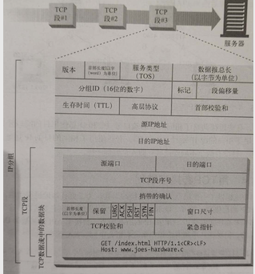

#### 4.1.2 tcp流是分段的， 由IP分组传送

TCP数据是通过名为**IP分组**的小数据块来发送的。

HTTP要传送一条报文时， 会以流的形式将报文数据的内容通过一条打开的TCP连接按序传输， TCP收到数据流后，会将数据流砍成段的小数据块， 并将段用封装在IP分组中， 通过因特网进行传输。

每个IP分组中包含

* 一个IP分组首部(通常20个字节)
* 一个TCP段首部（通常20个字节）
* 一个TCP数据块

#### 4.1.3 保持TCP连接持续不断的运行

IP协议到机器， TCP协议通过端口到应用

#### 4.1.4 用TCP套接字编程

略

### 4.2 对TCP性能的考虑

#### 4.2.2 性能聚焦区域

* TCP连接建立握手
* TCP慢启动拥塞控制
* 数据聚集的Nagle算法
* 用于捎带确认的TCP延迟确认算法
* TIME_WAIT时延和端口耗尽

#### 4.2.3 握手时延

现代的TCP栈都允许在客户端第三次握手的确认分组中发送数据

#### 4.2.4 延迟确认

TCP实现了自己的确认机制来确保数据的成功传输， 每个TCP段都有一个序列号和数据完整性校验和，每个段的接收者收到完好的段时， 都会向发送者回送一个小的确认分组， 如果指定时间内没有收到确认信息就重新发送数据。 由于确认报文很小， 所以通常和数据分组合并到一起发送。

延迟确认算法在一个 特性的时间窗口内将输出确认放在缓冲区内， 以寻找能够捎带它的输出数据分组， 如果没有数据分组， 那么就单独发送。

#### 4.2.5 TCP慢启动

TCP数据传输的性能还取决于TCP连接的**使用期** ， TCP会随时间进行自我调谐，起初限制最大速度， 传输成功后提升速度（比如每次提升一倍的传输分组数）， 这个过程叫**慢启动** ， 用于防止因特网的突然过载和拥塞。

